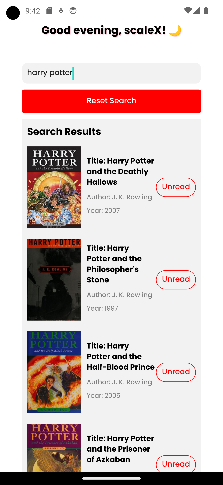

# 📚 BookApp

BookApp is a React Native application that allows users to search for books and manage their reading status.

## App Screenshots

### Home Page

{:height="40%" width="40%"}

### Search Page

{:height="40%" width="40%"}

## 📝 Prerequisites

Before you begin, ensure you have met the following requirements:

- You have installed Node.js and npm. You can download them from here.
- You have installed React Native CLI. If not, install it using the command `npm install -g react-native-cli`.
- You have a Windows/Mac/Linux machine.

## 🚀 Installing BookApp

To install BookApp, follow these steps:

1. Clone the repository:
   ```
   git clone https://github.com/Ciriously/bookapp.git
   ```
2. Navigate to the project directory:
   ```
   cd bookapp
   ```
3. Install the dependencies:
   ```
   npm install
   ```

## 🎮 Running BookApp

To run BookApp, follow these steps:

1. Start the Metro Bundler:
   ```
   npm start
   ```
2. Open a new terminal window and run the app:
   - For iOS:
     ```
     npx react-native run-ios
     ```
   - For Android:
     ```
     npx react-native run-android
     ```
